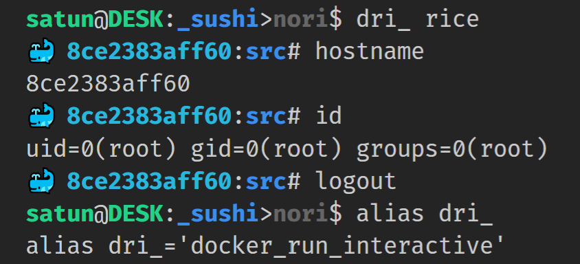

# tips

- [tips](#tips)
  - [git branch at bash prompt](#git-branch-at-bash-prompt)
  - [tagging docker intermediate images](#tagging-docker-intermediate-images)
  - [docker command aliases](#docker-command-aliases)
  - [bash prompt in docker container](#bash-prompt-in-docker-container)
    - [Solution:](#solution)

## git branch at bash prompt

To show git branch at bash prompt,

Add like `$(__git_ps1 ">%s")` to `PS1` of `~/.bashrc`:


## tagging docker intermediate images

To name each build stage as a tagged image,

first label it in `Dockerfile`:

```Dockerfile
FROM image AS tag
LABEL ref="project_service:tag"
```

Then filter images by the label and run `docker tag`:

```bash
REF="project_service:tag" && \
docker images -f label=ref=$REF -q \
| head -n 1 \
| xargs -I {} docker tag {} $REF
```

All of the above looks like this:


<!-- ## Thank you for reading! -->

## docker command aliases

Add to `~/.bash_aliases` as follows:

```bash
alias d='docker'
alias db='docker build -q .'
alias dr='docker run --rm $(docker build -q .)'
alias dri='docker_run_interactive $(docker build -q .)' # myfunc
alias dri_='docker_run_interactive' # myfunc
alias dl='docker logs -f'
alias dx='docker exec'
alias dxi_='docker_exec_interactive' # myfunc

alias dc='docker-compose'
alias dcb='docker-compose build'
alias dcr='docker-compose run --rm'
# alias dcu='docker-compose up -d'
alias dcl='docker-compose logs -f'
alias dcx='docker-compose exec'
# alias dcd='docker-compose down'

alias img='docker image'
alias ctn='docker container'

alias dfl='docker_images_filter_by_label_ref' # myfunc
alias dtl='docker_tag_by_label_ref' # myfunc
```

For `# myfunc`, see the [snip](snip) shell script with the same name.

If you want to use your own function like this, don't forget to add it to `~/.bashrc` as follows:

```bash
. ~/docs/tips/snip/.bashrc.hub.sh
```

## bash prompt in docker container

Here is 2 way to interact with a running container:

* `docker run -it IMAGE COMMAND`
* `docker exec -it CONTAINER COMMAND`

First, run salmon container of rice image. Then...


Holy shit, what a surprising white prompt!

This prompt is the `PS1` itself of `CONTAINER:~/.bashrc`

No matter how many times it is overwritten, it will return to white next time.

Bye, my ephemeral `PS1`...

### Solution:

Add to `CONTAINER:~/.bashrc` and restart `bash`

```bash
docker run -ite "DOCKER_PS1='$docker_ps1'" {IMAGE} bash -c 'echo "PS1=$DOCKER_PS1" >>~/.bashrc && bash -l'
```

[Here](snip/docker_run_interactive.sh) is the code I'm actually using, which gives the following result:



Hello, my pseudo-persistent `PS1`!

Let's look at the container counting down at `run -it` (left) from `exec -it` (right).


<!-- Thank you for reading! -->
__Thank you for reading!__
